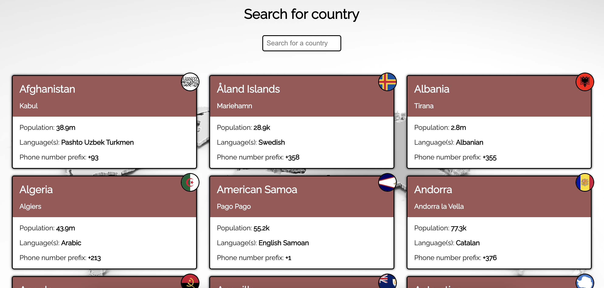
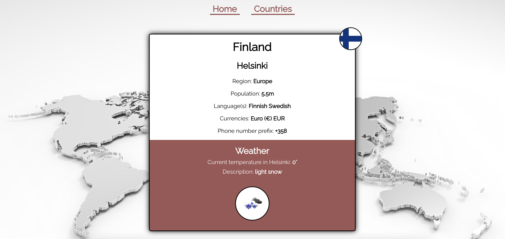

# Countries App

- Displays a list of countries from an external API and data of those countries (i.e. capital and flag)
- Displays a single country and data (incl. weather data) from external API when that specific country is clicked

## Screenshots

